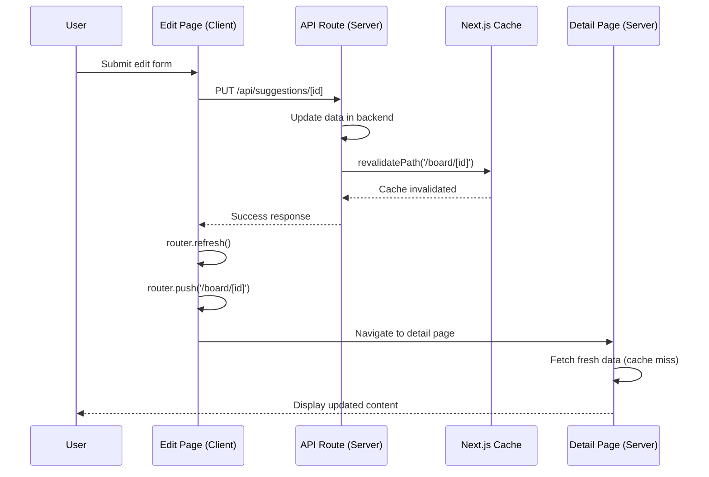

# Design Document

## Overview

This design addresses the cache invalidation issue in the board post editing flow. The solution uses Next.js 14+ App Router's built-in cache invalidation mechanisms (`revalidatePath` and `router.refresh()`) to ensure users see updated content immediately after editing.

The approach involves two complementary cache invalidation strategies:
1. **Server-side**: Using `revalidatePath` in the API route to invalidate ISR cache
2. **Client-side**: Using `router.refresh()` before navigation to clear Router Cache

This dual approach ensures both server-rendered and client-cached data are refreshed, providing immediate feedback to users while maintaining ISR performance benefits for other users.

## Architecture

### Current Flow (Problem)
```
User edits post → PUT /api/suggestions/[id] → Success response
                                              ↓
                                    router.push(/board/[id])
                                              ↓
                                    Serves cached page (stale data)
```

### New Flow (Solution)
```
User edits post → PUT /api/suggestions/[id] → Success response
                           ↓                           ↓
                  revalidatePath()              router.refresh()
                           ↓                           ↓
                  ISR cache cleared            Router cache cleared
                                              ↓
                                    router.push(/board/[id])
                                              ↓
                                    Fetches fresh data → Shows updated content
```

### Component Interaction



## Components and Interfaces

### 1. API Route Enhancement (`/api/suggestions/[id]/route.ts`)

**Modifications to PUT handler:**

```typescript
import { revalidatePath } from 'next/cache';

export async function PUT(
  request: NextRequest,
  { params }: { params: Promise<{ id: string }> }
) {
  try {
    const { id } = await params;
    const suggestionId = parseIntStrict(id);

    // ... existing authentication and validation code ...

    // Update the suggestion via backend
    const response = await backendClient.put(`/api/suggestions/${suggestionId}`, payload, {
      headers: { Cookie: cookieHeader },
    });

    const item = response.data;

    if (!item) {
      return NextResponse.json({ error: "건의사항을 찾을 수 없습니다." }, { status: 404 });
    }

    // Cache invalidation: Revalidate the detail page
    try {
      revalidatePath(`/board/${id}`);
      revalidatePath('/board'); // Also invalidate board list
      console.log(`Cache invalidated for /board/${id}`);
    } catch (revalidateError) {
      // Log error but don't fail the request
      console.error('Cache revalidation error:', revalidateError);
    }

    return NextResponse.json(transformSuggestion(item));
  } catch (error: any) {
    // ... existing error handling ...
  }
}
```

**Key Design Decisions:**
- Call `revalidatePath` after successful backend update but before returning response
- Invalidate both the specific detail page and the board list page
- Wrap revalidation in try-catch to ensure edit success even if cache invalidation fails
- Log cache invalidation for monitoring and debugging

### 2. Edit Page Enhancement (`/board/[id]/edit/page.tsx`)

**Modifications to handleSubmit:**

```typescript
const handleSubmit = async (e: React.FormEvent) => {
  e.preventDefault();

  // ... existing validation code ...

  setSaving(true);
  try {
    const response = await fetch(`/api/suggestions/${suggestionId}`, {
      method: 'PUT',
      headers: {
        'Content-Type': 'application/json',
      },
      credentials: 'include',
      body: JSON.stringify(form)
    });

    if (response.ok) {
      alert('건의사항이 성공적으로 수정되었습니다.');
      
      // Refresh router cache before navigation
      router.refresh();
      
      // Small delay to ensure refresh completes
      await new Promise(resolve => setTimeout(resolve, 100));
      
      // Navigate to detail page
      router.push(`/board/${suggestionId}`);
    } else {
      const error = await response.json();
      alert(error.error || '건의사항 수정에 실패했습니다.');
    }
  } catch (error) {
    console.error('건의사항 수정 실패:', error);
    alert('건의사항 수정 중 오류가 발생했습니다.');
  } finally {
    setSaving(false);
  }
};
```

**Key Design Decisions:**
- Call `router.refresh()` immediately after successful response
- Add small delay (100ms) to ensure refresh completes before navigation
- Keep existing error handling and user feedback
- Maintain the same user experience with improved cache handling

### 3. Detail Page (No Changes Required)

The detail page (`/board/[id]/page.tsx`) requires no modifications. The existing ISR configuration will work correctly:
- The `revalidate: 60` setting remains unchanged
- After cache invalidation, the next request will fetch fresh data
- The page will be regenerated on-demand when accessed after invalidation

## Data Models

No new data models are required. The existing `Suggestion` type and API response format remain unchanged.


## Correctness Properties

*A property is a characteristic or behavior that should hold true across all valid executions of a system—essentially, a formal statement about what the system should do. Properties serve as the bridge between human-readable specifications and machine-verifiable correctness guarantees.*

### Property 1: Cache Invalidation Paths

When a board post is successfully updated, the system must invalidate cache for both the specific detail page and the board list page.

**Example Test:** After a successful PUT request to `/api/suggestions/123`, verify that `revalidatePath` is called with `/board/123` and `/board`.

**Validates: Requirements 1.1, 2.1, 2.2**

### Property 2: Cache Invalidation Error Handling

When cache invalidation fails, the system must catch the error, log it, and still return a successful response for the PUT operation.

**Example Test:** When `revalidatePath` throws an error during a PUT request, verify that the error is caught, logged, and the PUT response is still successful (200 status).

**Validates: Requirements 1.4, 5.1**

### Property 3: Router Refresh Before Navigation

When redirecting after a successful edit, the edit page must call `router.refresh()` before `router.push()` with a small delay to ensure cache refresh completes.

**Example Test:** After a successful PUT response, verify that `router.refresh()` is called, followed by a delay, then `router.push()` is called with the correct path.

**Validates: Requirements 3.1, 3.4**

### Property 4: Router Refresh Error Resilience

When `router.refresh()` fails, the edit page must still proceed with the redirect to ensure users can navigate to the detail page.

**Example Test:** When `router.refresh()` throws an error, verify that the error is handled gracefully and `router.push()` is still called.

**Validates: Requirements 5.4**

### Property 5: ISR Configuration Preservation

The detail page must maintain its existing ISR configuration with 60-second revalidation after implementing cache invalidation.

**Example Test:** Verify that the detail page exports `revalidate = 60` and the fetch call includes `next: { revalidate: 60 }`.

**Validates: Requirements 4.1**

### Property 6: Successful Cache Invalidation Logging

When cache invalidation succeeds, the system must log the operation for monitoring and debugging purposes.

**Example Test:** After successful cache invalidation, verify that a console.log statement is executed with the invalidated path.

**Validates: Requirements 5.3**

## Error Handling

### API Route Error Handling

1. **Cache Invalidation Failures:**
   - Wrap `revalidatePath` calls in try-catch blocks
   - Log errors with sufficient context (path, error message)
   - Continue with successful PUT response
   - Do not expose cache invalidation errors to the client

2. **Backend Update Failures:**
   - Existing error handling remains unchanged
   - Return appropriate HTTP status codes (400, 401, 404, 500)
   - Include descriptive error messages in response

### Edit Page Error Handling

1. **Router Refresh Failures:**
   - Wrap `router.refresh()` in try-catch (optional, as it rarely fails)
   - If refresh fails, log the error and proceed with navigation
   - Ensure user is not blocked from seeing their changes

2. **Navigation Failures:**
   - Existing error handling remains unchanged
   - Display user-friendly error messages
   - Maintain form state in case of failure

### Fallback Behavior

If cache invalidation completely fails:
- User will see stale data initially
- ISR will naturally refresh the page within 60 seconds
- User can manually refresh the browser to see changes
- The edit operation itself still succeeds

## Testing Strategy

### Unit Tests

Unit tests will focus on specific examples and error conditions:

1. **API Route Tests:**
   - Test that `revalidatePath` is called with correct paths after successful PUT
   - Test that cache invalidation errors are caught and logged
   - Test that PUT succeeds even when cache invalidation fails
   - Test that successful cache invalidation is logged

2. **Edit Page Tests:**
   - Test that `router.refresh()` is called before `router.push()`
   - Test that navigation proceeds even if `router.refresh()` fails
   - Test the delay between refresh and navigation

3. **Detail Page Tests:**
   - Test that ISR configuration (`revalidate = 60`) is preserved
   - Test that the page structure remains unchanged

### Integration Tests

Integration tests will verify the end-to-end flow:

1. **Cache Invalidation Flow:**
   - Edit a post via the edit page
   - Verify the API route invalidates cache
   - Verify the detail page shows updated content
   - Verify other posts' caches are not affected

2. **Error Scenarios:**
   - Test behavior when `revalidatePath` is unavailable
   - Test behavior when backend update succeeds but cache invalidation fails
   - Verify user experience remains acceptable in error cases

### Manual Testing Checklist

1. Edit a post and verify changes appear immediately on detail page
2. Edit a post and verify board list shows updated title
3. Verify other users' cached pages are not affected
4. Test with browser cache enabled
5. Test with slow network conditions
6. Verify metadata (OpenGraph, JSON-LD) updates correctly
7. Test error scenarios (network failures, permission errors)

### Testing Configuration

- Unit tests should mock Next.js functions (`revalidatePath`, `router.refresh()`, `router.push()`)
- Integration tests should use a test Next.js environment
- Manual testing should be performed in both development and production builds
- Test with both client-side navigation and direct URL access
