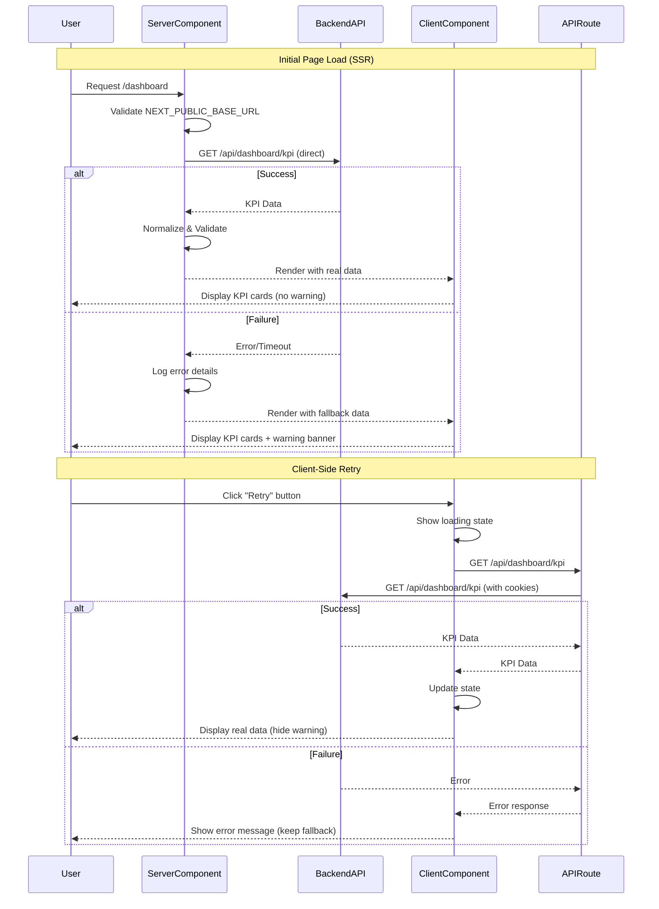

# Design Document: Dashboard KPI Error Fix

## Overview

This design addresses the reliability issues in the dashboard KPI data fetching system. The current architecture has the server component calling its own API route during SSR, which then proxies to the backend. This creates unnecessary network hops and multiple failure points.

The solution simplifies the architecture by having the server component communicate directly with the backend API, implements comprehensive error handling with user-friendly feedback, and provides graceful degradation when data is unavailable. The design maintains backward compatibility with the existing client component while improving reliability and user experience.

**Key Design Decisions:**
- Remove the intermediate API route hop for SSR requests
- Keep the API route for client-side retry functionality
- Use NEXT_PUBLIC_BASE_URL for backend communication
- Display warning banners when showing fallback data
- Implement client-side retry without full page refresh

## Architecture

### Current Architecture (Problematic)

```
Server Component (SSR)
    ↓ HTTP fetch
API Route (/api/dashboard/kpi)
    ↓ axios + cookie forwarding
Backend API
```

**Problems:**
- Double network hop increases latency and failure points
- Cookie forwarding complexity between layers
- Server component calling its own API route during SSR
- No user feedback when fallback data is displayed
- **Current Issue: 401 Unauthorized errors** - Cookies are not being forwarded from the server component to the backend API

### New Architecture (Improved)

```
Server Component (SSR)
    ↓ Direct axios call
Backend API

Client Component (Browser)
    ↓ HTTP fetch (retry only)
API Route (/api/dashboard/kpi)
    ↓ axios + cookie forwarding
Backend API
```

**Benefits:**
- Single network hop for initial SSR load
- Simpler cookie handling (server-side only)
- API route preserved for client-side retries
- Clear separation of concerns
- Better error handling and user feedback

### Component Interaction Flow



## Components and Interfaces

### 1. Server Component (page.tsx)

**Responsibilities:**
- Fetch KPI data directly from backend during SSR
- Validate environment configuration
- Handle errors gracefully with fallback data
- Log detailed error information
- Pass data to client component

**Key Functions:**

```typescript
async function getKPIData(): Promise<KPIData>
```
- Validates NEXT_PUBLIC_BASE_URL is configured
- **Retrieves cookies from Next.js cookies() function**
- **Formats cookies as Cookie header string**
- Creates axios instance with timeout and cookie forwarding
- Makes direct request to backend API
- Handles network errors, timeouts, HTTP errors (including 401), and parsing errors
- Logs all error details with timestamps
- Returns normalized KPI data or fallback data

```typescript
function validateBackendUrl(url: string | undefined): string | null
```
- Checks if URL is defined and non-empty
- Validates URL format
- Returns validated URL or null if invalid
- Logs configuration errors

**Error Handling Strategy:**
- Network errors → Log + return fallback
- Timeout errors → Log + return fallback
- HTTP errors (4xx/5xx) → Log status + return fallback
- JSON parsing errors → Log + return fallback
- Configuration errors → Log + return fallback
- Never throw errors (prevent error boundaries)

### 2. Client Component (DashboardClient.tsx)

**Responsibilities:**
- Display KPI data received from server
- Detect when fallback data is being shown
- Provide retry mechanism for failed requests
- Show warning banner when data is unavailable
- Manage loading and error states for retries

**New State:**

```typescript
interface ClientState {
  kpiData: KPIData;           // Current KPI data (may be fallback)
  isRetrying: boolean;        // True during retry fetch
  retryError: string | null;  // Error message from failed retry
  showWarning: boolean;       // True when displaying fallback data
}
```

**New Functions:**

```typescript
function isFallbackData(data: KPIData): boolean
```
- Checks if all KPI values are zero
- Returns true if data appears to be fallback

```typescript
async function handleRetry(): Promise<void>
```
- Sets loading state
- Fetches from /api/dashboard/kpi
- Updates state with new data or error
- Clears warning if successful

**UI Components:**

```typescript
<WarningBanner />
```
- Displays when fallback data is detected
- Shows user-friendly message about data unavailability
- Includes "Retry" button
- Dismissible (but reappears on page refresh if still failing)

### 3. API Route (route.ts)

**Responsibilities:**
- Handle client-side retry requests
- Forward cookies to backend
- Return structured error responses

**Changes:**
- No changes needed to existing implementation
- Continues to serve client-side requests
- No longer called during SSR

### 4. Backend Client Configuration

**New Approach:**
- Server component creates its own axios instance
- Uses NEXT_PUBLIC_BASE_URL from environment
- Configures timeout (15 seconds)
- Includes cookie forwarding from Next.js cookies()

**Configuration:**

```typescript
// Get cookies from Next.js
const cookieStore = await cookies();
const cookieHeader = cookieStore
  .getAll()
  .map((cookie) => `${cookie.name}=${cookie.value}`)
  .join("; ");

// Create axios instance with cookies
const backendClient = axios.create({
  baseURL: process.env.NEXT_PUBLIC_BASE_URL,
  timeout: 15000,
  headers: {
    'Accept': 'application/json',
    'Cookie': cookieHeader  // Forward authentication cookies
  }
});
```

**Critical:** The server component must use Next.js `cookies()` function to access request cookies and forward them to the backend. This is essential for authenticated requests.

## Data Models

### KPIData Interface

```typescript
interface KPIData {
  totalCrosswalks: number;
  signalInstallationRate: number;
  riskIndex: number;
  accidentReductionRate: number;
  safetyIndex: number;
}
```

**Validation Rules:**
- All fields must be present
- All fields must be valid numbers (not NaN, not Infinity)
- Missing or invalid fields default to 0
- Validation performed by existing `normalizeKpiPayload()` function

### Error Response Format

```typescript
interface ErrorResponse {
  error: string;           // User-friendly error message
  details?: string;        // Technical details (optional)
  timestamp: string;       // ISO timestamp
  statusCode?: number;     // HTTP status if applicable
}
```

### Retry State

```typescript
interface RetryState {
  isRetrying: boolean;
  error: string | null;
  lastAttempt: Date | null;
}
```

## Error Handling

### Error Categories and Responses

**Note on 401 Unauthorized Errors:** The current implementation is experiencing 401 errors because cookies are not being properly forwarded from the server component to the backend API. The fix ensures that all cookies from the incoming request are retrieved using Next.js `cookies()` function and formatted as a Cookie header for the backend request.

| Error Type | Detection | Logging | User Feedback | Fallback Behavior |
|------------|-----------|---------|---------------|-------------------|
| Network Error | `error.code === 'ECONNREFUSED'` | Log full error + URL | Warning banner | Return fallback data |
| Timeout | `error.code === 'ECONNABORTED'` | Log timeout + URL | Warning banner | Return fallback data |
| HTTP 401 | `response.status === 401` | Log auth error | Warning banner | Return fallback data |
| HTTP 4xx | `response.status >= 400 && < 500` | Log status + message | Warning banner | Return fallback data |
| HTTP 5xx | `response.status >= 500` | Log status + message | Warning banner | Return fallback data |
| Invalid JSON | JSON parse error | Log parse error | Warning banner | Return fallback data |
| Missing Config | `!NEXT_PUBLIC_BASE_URL` | Log config error | Warning banner | Return fallback data |
| Invalid Data | Field validation fails | Log validation warning | None (normalized) | Use fallback values for invalid fields |

### Error Logging Format

```typescript
interface ErrorLog {
  timestamp: string;
  errorType: 'network' | 'timeout' | 'http' | 'parse' | 'config' | 'validation';
  url?: string;
  statusCode?: number;
  message: string;
  details?: any;
}
```

**Example Log Output:**
```
[2024-01-15T10:30:45.123Z] [Dashboard KPI] Network error: ECONNREFUSED
  URL: https://api.example.com/api/dashboard/kpi
  Details: connect ECONNREFUSED 127.0.0.1:8000
```

### Retry Logic

**Server-Side (SSR):**
- No automatic retries
- Single attempt per page load
- Relies on Next.js ISR revalidation (60 seconds)

**Client-Side:**
- Manual retry via button click
- No automatic retries
- User controls when to retry
- Loading state during retry
- Error message if retry fails

## Testing Strategy

### Unit Tests

Unit tests will verify specific examples, edge cases, and error conditions. They complement property-based tests by focusing on concrete scenarios.

**Test Cases:**

1. **Environment Validation**
   - Valid NEXT_PUBLIC_BASE_URL → accepts
   - Missing NEXT_PUBLIC_BASE_URL → returns null
   - Invalid URL format → returns null
   - Empty string → returns null

2. **Fallback Detection**
   - All zeros → detected as fallback
   - Any non-zero value → not fallback
   - Mixed zeros and values → not fallback

3. **Error Response Handling**
   - Network error → returns fallback + logs
   - Timeout error → returns fallback + logs
   - 404 response → returns fallback + logs
   - 500 response → returns fallback + logs
   - Invalid JSON → returns fallback + logs

4. **Data Normalization**
   - Valid data → passes through
   - Missing field → defaults to 0
   - NaN value → defaults to 0
   - Infinity value → defaults to 0
   - String number → converts to number

5. **Client Retry**
   - Successful retry → updates state
   - Failed retry → shows error message
   - Loading state during retry
   - Warning banner hides on success

### Property-Based Tests

Property-based tests will verify universal properties across many generated inputs. Each test will run a minimum of 100 iterations.

**Testing Library:** We'll use `fast-check` for TypeScript property-based testing.

**Test Configuration:**
```typescript
fc.assert(
  fc.property(/* generators */, (/* inputs */) => {
    // Property assertion
  }),
  { numRuns: 100 }
);
```


## Correctness Properties

A property is a characteristic or behavior that should hold true across all valid executions of a system—essentially, a formal statement about what the system should do. Properties serve as the bridge between human-readable specifications and machine-verifiable correctness guarantees.

### Property 1: Error Resilience

*For any* error condition (network error, timeout, HTTP error status, or JSON parsing error), the system SHALL return fallback KPI data without throwing exceptions.

**Validates: Requirements 2.1, 2.3, 2.4, 4.1**

**Rationale:** This property ensures graceful degradation across all failure modes. By testing with randomly generated error conditions, we verify that no error type can crash the application or trigger error boundaries.

### Property 2: Comprehensive Error Logging

*For any* backend request error, the logged error information SHALL include the error type, the requested URL, the HTTP status code (if applicable), the error message (if available), and a timestamp.

**Validates: Requirements 5.1, 5.2, 5.3, 5.4, 5.5**

**Rationale:** This property ensures debugging information is always complete. By generating various error scenarios, we verify that all necessary diagnostic information is captured regardless of error type.

### Property 3: Warning Banner Consistency

*For any* KPI data state, the warning banner SHALL be visible if and only if the data is fallback data (all values are zero).

**Validates: Requirements 2.5, 3.4**

**Rationale:** This property ensures users always know when they're viewing fallback data. By testing with randomly generated KPI data (both fallback and real), we verify the warning banner appears exactly when needed.

### Property 4: Data Validation and Normalization

*For any* backend response payload, all required KPI fields SHALL be validated, any invalid numeric values SHALL be replaced with fallback values (zero), and warnings SHALL be logged for each replacement.

**Validates: Requirements 8.1, 8.2, 8.3, 8.5**

**Rationale:** This property ensures data integrity regardless of backend response quality. By generating payloads with missing fields, invalid numbers (NaN, Infinity), and wrong types, we verify the normalization process handles all cases correctly.

### Property 5: URL Validation

*For any* string value provided as NEXT_PUBLIC_BASE_URL, the validation function SHALL correctly identify whether it is a valid URL format.

**Validates: Requirements 7.4**

**Rationale:** This property ensures configuration errors are caught early. By generating various invalid URL formats (empty strings, malformed URLs, non-URL strings), we verify the validation logic is robust.

### Property 6: Retry State Updates

*For any* successful client-side retry that returns valid KPI data, the client component SHALL update the displayed KPI values to match the fetched data and hide the warning banner.

**Validates: Requirements 6.4**

**Rationale:** This property ensures retry functionality correctly updates the UI. By generating random valid KPI responses, we verify that successful retries always result in proper state updates.

### Edge Cases

The following edge cases will be explicitly tested as part of property test generators:

1. **Timeout Errors** (Requirement 2.2): Included in Property 1 error generation
2. **Empty Response Bodies**: Included in Property 4 validation testing
3. **Malformed JSON**: Included in Property 1 error generation
4. **Missing Environment Variables**: Covered by unit tests (Requirement 7.1-7.3)
5. **Concurrent Retry Attempts**: Covered by unit tests for race conditions

### Non-Testable Requirements

The following requirements are not amenable to automated property-based testing:

- **Requirement 1.1**: Architectural decision about direct backend communication (verified through code review)
- **Requirement 4.3**: Map functionality independence (integration test, not a property)
- **Requirement 4.4**: Error boundary behavior (covered by Property 1)
- **Requirement 6.1**: Retry mechanism presence (covered by Requirements 3.1, 3.2)
- **Requirement 8.4**: Use of specific function (implementation detail)

These requirements will be verified through unit tests, integration tests, or code review rather than property-based tests.
